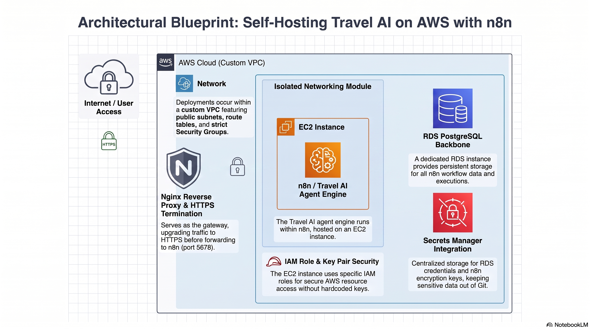

# Travel AI Self hosted at AWS — Overview

Business Context: This repository contains the Infrastructure as Code (IaC) to securely host Travel AI. Travel AI is an intelligent agent-based engine built on n8n that automates custom travel itineraries using GPT-4o-mini, GPT-5, and Human-in-the-Loop (HITL) validation.

Link to Travel AI: https://github.com/carlostorresCloud/TravelAI


## What is included

- `providers.tf` — Terraform and AWS provider setup
- `variables.tf` — inputs you can change
- `main.tf` — wires the modules together
- `outputs.tf` — useful outputs like public IP and secret ARNs
- `terraform.tfvars.example` — copy this to `terraform.tfvars`
- `modules/`
  - `networking/` — VPC, public subnets, route table, security groups
  - `ec2/` — EC2 instance for n8n, key pair, IAM role
  - `rds/` — PostgreSQL database
  - `secrets_manager/` — stores DB credentials and n8n encryption key


## Architecture Diagram




## Before you deploy

1. Copy `terraform.tfvars.example` to `terraform.tfvars`.
2. Set `key_pair_public_key`, `allowed_ssh_cidr`, and `allowed_n8n_cidr`.
3. Do not commit `.tfstate`, `.tfvars`, or `.terraform/` (Refer to .gitignore to make sure are included there).

## Requirements

- Terraform 1.5 or newer
- AWS CLI configured with appropriate AWS credentials
- SSH key pair for the EC2 instance
- A DNS domain(DuckDNS is a very good free choice)

## Deploy

```bash
cp terraform.tfvars.example terraform.tfvars
# edit terraform.tfvars
terraform init
terraform plan
terraform apply
```

After apply, the output shows the public IP. For initial testing only, n8n is reachable at:

`http://<public-ip>:5678`

**For production, complete Phase 2 mentioned below** — do not leave this port open publicly.

## Phase 2: Production Security (Nginx + HTTPS) - Do this after deploying the infra with terraform


After the initial lift-and-shift, the EC2 instance was reachable over plain HTTP on port 5678 — not safe for production. This phase adds:

- **Nginx reverse proxy** — routes all incoming traffic to the n8n container instead of exposing it directly.
- **HTTPS via Let's Encrypt/Certbot** — free SSL certificate with automatic renewal every 90 days.
- **Port 5678 closed to the public** — all traffic now enters exclusively through HTTPS (443).
- **WebSocket support** — `Upgrade` and `Connection` headers are forwarded so n8n's real-time workflow execution view works correctly through the proxy.

Nginx config used is in `nginx/n8n.conf` (see below).

### Nginx setup(You need to SSH into the EC2 instance to configure NGINX)

```bash
sudo apt install nginx certbot python3-certbot-nginx -y
sudo cp nginx/n8n.conf /etc/nginx/sites-available/n8n
sudo ln -s /etc/nginx/sites-available/n8n /etc/nginx/sites-enabled/
sudo nginx -t && sudo systemctl reload nginx
sudo certbot --nginx -d your-domain.com
```

After this, close port 5678 in the EC2 security group — traffic should only flow through 443.


## Cost notes

- EC2 and RDS can fit the AWS free tier for new accounts.
- Secrets Manager is not free long-term.
- No NAT Gateway is used here.
- The cost of buying a domain, however you can use DuckDNS for free for domain testing purpose

## Important security advice

- Do not leave `allowed_ssh_cidr` or `allowed_n8n_cidr` as `0.0.0.0/0` in production.
- Keep secrets in AWS Secrets Manager, not in Git.
- Move Terraform state to remote storage such an S3 bucket if you use this beyond testing.

## Destroy

```bash
terraform destroy
```
